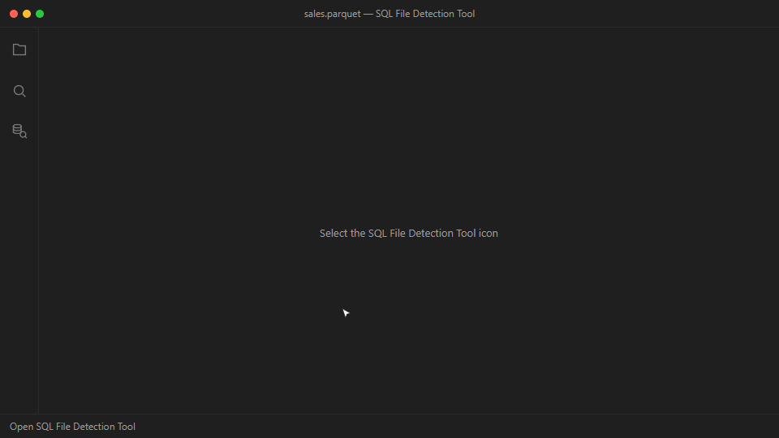

# SQL File Detection Tool

> **Beta.** This extension is published as a **Preview**. It is usable day to
> day, but the interface and the generated SQL are still changing, and it has
> not yet been exercised against every SQL platform on real hardware. Review
> generated statements before running them, and please report anything wrong.

Preview data files and generate platform-aware T-SQL without leaving VS Code.

> **Independent project:** This is a personal open-source project by Hugo
> Queiroz. It is not affiliated with, sponsored, endorsed, approved, or
> certified by Microsoft. Microsoft product names are used only to describe
> compatibility.

**Topics:** ETL · Data Engineering · Bulk Loading · Data Virtualization ·
PolyBase

## What it does

- Previews CSV, TSV, DAT, JSON, JSON Lines, Parquet, and Delta sources.
- Maps detected columns to recommended SQL data types.
- Generates `CREATE TABLE`, `BULK INSERT`, `OPENROWSET`, and external-table SQL.
- Targets SQL Server, Azure SQL Database, Azure SQL Managed Instance, and Fabric
  SQL Database.
- Verifies Azure sign-in and accessible directories through VS Code's built-in
  Microsoft authentication only after explicit Connect, with Refresh and
  bounded transient retries.
- Browses accessible Blob Storage and ADLS Gen2 accounts read-only, then sends a
  selected file's ABS/ABFSS location to Storage SQL without downloading it.
- Detects ABS, ADLS, or ABFSS from a storage URL and generates credential and
  external-data-source setup.

## Use it

1. Open **SQL File Detection Tool** from the Activity Bar.
2. Choose **Browse local** for one folder or one or more files, or choose
  **Browse Azure**. Switching back to local disconnects the extension's Azure
  browser and restores the retained location without opening another picker.
3. Review the preview, schema mapping, and generated SQL tabs.

For external storage, open **Storage SQL** and paste an `abs://`, `adls://`,
or `abfss://` URL. Pasting a URL does not sign in to storage or collect secrets;
authenticated browsing begins only after **Connect to Azure** is selected.

## Notes

- Analysis runs locally in the extension host with no external service.
- Preview reads are bounded for large files.
- ORC and RCFile are recognized, but their schemas are not inspected natively.
- Generated SQL is a starting point; review types, paths, and credentials before
  running it.

[Source](https://github.com/HugoMSFT/SQL-File-Detection-Tool) ·
[Report an issue](https://github.com/HugoMSFT/SQL-File-Detection-Tool/issues)
