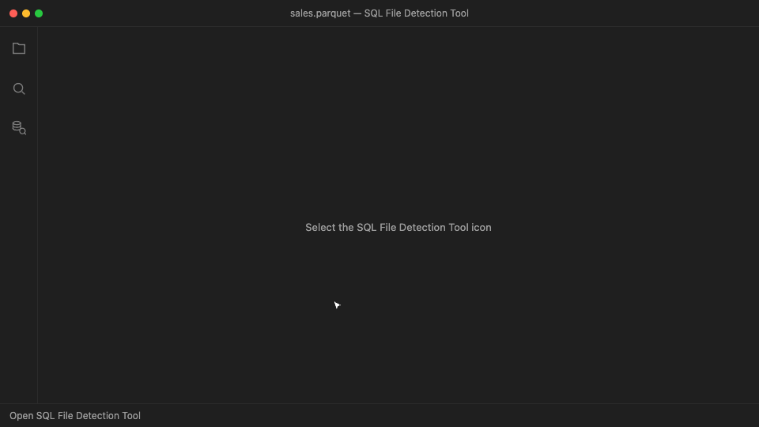

# SQL File Detection Tool

Preview data files and generate platform-aware T-SQL without leaving VS Code.

> **Independent project:** This is a personal open-source project by Hugo
> Queiroz. It is not affiliated with, sponsored, endorsed, approved, or
> certified by Microsoft. Microsoft product names are used only to describe
> compatibility.

## What it does

- Previews CSV, TSV, DAT, JSON, JSON Lines, Parquet, Delta, and Iceberg sources.
- Maps detected columns to recommended SQL data types.
- Generates `CREATE TABLE`, `BULK INSERT`, `OPENROWSET`, and external-table SQL.
- Targets SQL Server, Azure SQL Database, Azure SQL Managed Instance, and Fabric
  SQL Database.
- Detects ABS, ADLS, or ABFSS from a storage URL and generates credential and
  external-data-source setup.

## Use it

1. Open **SQL File Detection Tool** from the Activity Bar.
2. Select a supported file or folder.
3. Review the preview, schema mapping, and generated SQL tabs.

For external storage, open **Credential setup** and paste an `abs://`, `adls://`,
or `abfss://` URL. The extension does not sign in to storage or collect secrets.

## Notes

- Analysis runs locally in the extension host with no external service.
- Preview reads are bounded for large files.
- ORC and RCFile are recognized, but their schemas are not inspected natively.
- Generated SQL is a starting point; review types, paths, and credentials before
  running it.

[Source](https://github.com/HugoMSFT/SQL-File-Detection-Tool) ·
[Report an issue](https://github.com/HugoMSFT/SQL-File-Detection-Tool/issues)
