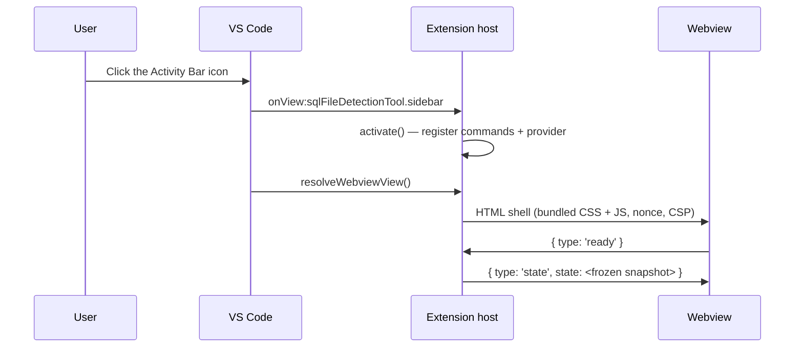

# The native VS Code interface

This document describes what happens between the moment a user clicks the
Activity Bar icon and the moment T-SQL appears on screen, and the trust
boundaries that make that safe. It is the companion to
[`docs/native-core.md`](native-core.md), which covers the analysis and SQL
generation engine underneath.

The short version: the extension is a single Node process. There is no virtual
environment, no `pip`, no Flask server, no TCP port, no Simple Browser and no
child process. Everything the user sees is a VS Code webview backed by
TypeScript running in the extension host.

## Module map

| Module | `vscode` import? | Responsibility |
| --- | --- | --- |
| `src/extension.ts` | yes | Activation. Registers four commands and one `WebviewViewProvider`. Nothing else. |
| `src/nativeView.ts` | yes | The only other module that touches the VS Code API. Implements `UiHost` and owns the sidebar and panel surfaces. |
| `src/ui/controller.ts` | no | All product logic. Receives untrusted messages, drives the native service, mutates the shared store. |
| `src/ui/host.ts` | no | The `UiHost` seam. Everything the controller needs from the editor, expressed as an interface. |
| `src/ui/webviewShell.ts` | no | Builds the HTML shell, the CSP and the nonce. |
| `src/appState.ts` | no | The shared model, the file registry and the containment roots. |
| `src/protocol.ts` | no | The message contract and the single validation choke point. |
| `src/native/*` | no | Layer 1: analysis and SQL generation. |

Keeping `vscode` confined to two files is what makes the rest of the extension
testable with plain `node --test`, and it is what lets
`src/test/nativeRuntime.test.ts` walk the compiled module graph and assert that
nothing reachable from activation can spawn a process or bind a port.

## Startup



Nothing in that sequence reads a file, resolves a host name or opens a socket.
Measured on the reference machine, activation is under 1 ms, the first render is
under 1 ms, and the first analysis of a small CSV is roughly 20 ms end to end
including the round trip. Those numbers are asserted, not just documented:
`src/test/nativeRuntime.test.ts` fails if activation exceeds 500 ms or first
render exceeds 1.5 s, and the output channel records all three timings so a slow
machine can be diagnosed from a bug report.

## Preview-first workflow

Preview is the initial tab and primary workflow. The left navigator persists
across tabs, while the main view starts with bounded real rows from the selected
file. Metadata and Schema separate detected facts from type overrides. Focused
tabs expose `CREATE TABLE`, `BULK INSERT`, `OPENROWSET`, external file format,
external table, and URL-driven credential setup. Quick Analyze,
Formats, Best Practices, COPY INTO, JSON, and FOR JSON are not navigation tabs.
JSON guidance is emitted only in the relevant `OPENROWSET` or external-table
context.

The credential tab is a five-step wizard: storage URL, target platform, detected
external data source, authentication, and object names. `credentialWizard.ts`
infers ABS, ADLS, or ABFSS from the URL and constrains the remaining choices
before generation. Fabric SQL Database allows only OneLake over ABFSS with
`USER IDENTITY`; OneLake on the other supported products uses the ADLS
connector; SQL Server 2022 S3 uses `S3 ACCESS KEY`; and SQL Server 2025 managed
identity carries its Azure Arc and user-assigned identity caveat. The webview
receives no SAS token, access key, or master-key password. Generated SQL contains
placeholders that users replace later in a secure editor.

Folder scans retain one metadata record per file. Generation and schema
overrides remain selected-file scoped. Storage URLs configure generated SQL but
are never fetched. Local files expose direct SQL Server/UNC reads where supported
and otherwise state that staging is required.

Generated-statement headers and relevant external-object readiness entries show
platform-aware Microsoft Learn links. The renderer receives only typed
documentation identifiers, never URLs. The extension host maps those identifiers
and the current platform to an exact `https://learn.microsoft.com` page and opens
it with `vscode.env.openExternal`. Unsupported command/platform combinations do
not receive a command link. SQL Server documentation is pinned to the 2019,
2022, or 2025 view; Azure SQL Database, Managed Instance, and Fabric use their
current product views.

## The message boundary

A webview is a browser context. Treat it as hostile: an XSS in a rendering bug,
a malicious file name, or a compromised dependency could all end up posting
messages. The extension therefore assumes every message is attacker-controlled.

**One entry point.** `parseWebviewRequest()` in `src/protocol.ts` is the only
way a message becomes a typed request. It:

- rejects anything that is not a plain object with a known `type`;
- looks the type up in a builder table rather than dispatching on the string, so
  an inherited or prototype-polluted property cannot select a handler;
- reads every field through `text()`, `member()` or `count()` helpers that bound
  length, reject control characters, and clamp numbers;
- returns `undefined` for anything it does not fully understand, which the
  controller logs and drops. There is no default case and no partial acceptance.

`UiController.handle()` never throws. A renderer must not be able to take down
the extension host by posting something unexpected, so every failure becomes a
redacted `error` field on the next state snapshot.

**The renderer never names a file.** This is the single most important property
of the design. The webview cannot send a path, a root, a URL for a local file,
or a directory to scan. It can only send an opaque `fileId` that the extension
host minted with `crypto.randomUUID()` when it registered the file. Each
registry entry carries its own `allowedRoot`, and every native call passes both
`filePath` and `allowedRoot` so the Layer 1 realpath containment check applies.
An id from a previous selection is simply not found, so a stale or forged id
fails closed.

Files enter the registry through paths the *user* chose: an open dialog, a
workspace folder pick, the active editor, or an explorer context menu — all
resolved in `src/nativeView.ts` with the real `vscode.Uri`.

**State flows one way.** The host owns an `AppStateStore`. After any change it
pushes a whole frozen snapshot to every attached surface. The sidebar and the
editor panel are two views of one store, so they cannot diverge, and a surface
that reconnects gets the current truth rather than a replayed diff.

**Display labels, not paths.** `metadataForDisplay()` replaces `file_path` with
a workspace-relative label before the metadata reaches a renderer. The real path
stays host-side in `UiController.rawMetadata`, because `BULK INSERT` genuinely
needs it. A test scans every snapshot in the controller suite for absolute paths.

## Content Security Policy

The shell is built by `buildWebviewHtml()` with a per-load nonce:

```
default-src 'none';
img-src {cspSource} data:;
style-src {cspSource} 'nonce-{nonce}';
script-src 'nonce-{nonce}';
font-src {cspSource};
```

- `default-src 'none'` with no `connect-src` means the renderer has **no network
  access at all**. It cannot fetch, it cannot open a WebSocket, and it cannot be
  used as an SSRF pivot.
- There is exactly one `<script>`, it carries the nonce, and it is a local
  bundled file. No CDN, no inline handler, no `eval`, no `new Function`.
- The renderer builds DOM with `textContent` and `<template>` cloning. It never
  assigns `innerHTML` from data.

`src/test/webviewShell.test.ts` enforces all of this statically: it strips
comments from `media/webview/main.js` and then fails the build on `innerHTML`,
`eval`, `fetch`, `XMLHttpRequest`, `localStorage`, `document.write`, inline
`on*=` attributes in the HTML, any second script tag, or any remote resource
reference.

## Storage setup and threat model

Credential setup has one entry path: a storage URL. The host validates and
normalizes the location, strips query strings and fragments, infers the storage
type, and generates credential/data-source SQL without fetching the URL.

The extension performs no storage authentication, account discovery, container
listing, or remote download. There is no `vscode.authentication` call, no Azure
connection state in the renderer model, and no browser command in the manifest
or message protocol.

The URL boundary remains strict:

- `abs://` selects Azure Blob and emits the ABS connector.
- `adls://` selects Azure Data Lake and emits the ADLS connector.
- `abfss://` selects OneLake on Fabric and emits ABFSS; supported non-Fabric
  targets use the documented ADLS mapping.
- Azure HTTPS and `s3://` locations remain supported for compatibility.
- Query strings and fragments are removed before state or generated SQL is
  updated. A `sig` parameter selects SAS generation but the signature itself is
  discarded.
- The extension never asks for a token, key, or password. Generated SQL uses
  placeholders for any secret-bearing authentication method.

## Cancellation and stale results

Analysis is serialised through `createSerialQueue()`, so two concurrent requests
keep their own arguments and their own results rather than one being satisfied
by the other. On top of that:

- `begin()` bumps a monotonic `generation` and cancels the previous
  `CancellationTokenSource`.
- Every `await` is followed by `isCurrent(generation)`; a superseded task drops
  its result instead of writing it. A slow analysis of file A can therefore never
  overwrite a fast analysis of file B.
- The token reaches all the way down into the native analysis service.
- Schema and SQL regeneration is debounced, so typing in the table name field
  does not start work on every keystroke.

## Limitations the UI states rather than hides

- **ORC.** The native reader cannot inspect ORC. The UI says
  *"The native extension cannot inspect ORC yet"*, explains why (a compressed
  footer and stripe layout the bundled reader does not implement), and offers a
  manual workaround: if you have separately installed the optional Python
  command line package, run it yourself. **The extension never installs or
  launches Python on your behalf**, and there is no code path that could.
- **RCFile** is recognition-only.
- **Virtual and remote schemes.** The native reader needs a real filesystem
  path. For a non-`file:` URI the extension says so and suggests saving a local
  copy, rather than silently doing nothing.

## The optional Python package

The Python CLI and Flask web application still exist and still work. They are
now **optional legacy compatibility**, not part of the extension runtime:

- No contributed command, view, menu or activation event reaches them.
- `src/backend.ts`, `src/pythonEnv.ts`, `src/process.ts` and
  `src/legacyBackendUrl.ts` remain as deprecated transition code, unreferenced
  by the native path. Layer 3 removes them along with the packaging changes.
- `src/legacyBackendUrl.ts` exists specifically so that port binding, loopback
  URL construction and health polling live in a module the native graph does not
  import — which `src/test/nativeRuntime.test.ts` verifies.
