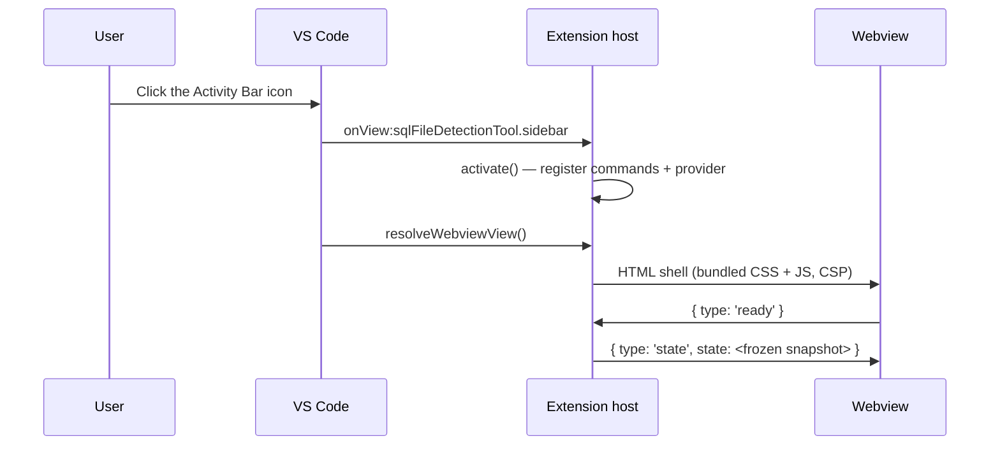

# The native VS Code interface

This document describes what happens between the moment a user clicks the
Activity Bar icon and the moment T-SQL appears on screen, and the trust
boundaries that make that safe. It is the companion to
[`docs/native-core.md`](native-core.md), which covers the analysis and SQL
generation engine underneath.

The short version: the extension is a single Node process. There is no virtual
environment, no `pip`, no Flask server, no TCP port, no Simple Browser and no
child process. Everything the user sees is a VS Code webview backed by
TypeScript running in the extension host.

## Module map

| Module | `vscode` import? | Responsibility |
| --- | --- | --- |
| `src/extension.ts` | yes | Activation. Registers four commands and one `WebviewViewProvider`. Nothing else. |
| `src/nativeView.ts` | yes | The only other module that touches the VS Code API. Implements `UiHost` and owns the sidebar and panel surfaces. |
| `src/ui/controller.ts` | no | All product logic. Receives untrusted messages, drives the native service, mutates the shared store. |
| `src/ui/host.ts` | no | The `UiHost` seam. Everything the controller needs from the editor, expressed as an interface. |
| `src/ui/webviewShell.ts` | no | Builds the HTML shell and extension-origin-only CSP. |
| `src/appState.ts` | no | The shared model, the file registry and the containment roots. |
| `src/fileSettings.ts` | no | Bounded session-only file settings/Undo and strict, credential-free import-profile validation. |
| `src/protocol.ts` | no | The message contract and the single validation choke point. |
| `src/azure/*` | no | Explicit Microsoft sign-in or known-public-container listing, bounded discovery, and mode/auth lifecycle reconciliation. |
| `src/native/*` | no | Layer 1: analysis and SQL generation. |

Keeping `vscode` confined to two files is what makes the rest of the extension
testable with plain `node --test`, and it is what lets
`src/test/nativeRuntime.test.ts` walk the compiled module graph and assert that
nothing reachable from activation can spawn a process or bind a port.

## Startup


```mermaid
sequenceDiagram
    participant U as User
    participant C as VS Code
    participant E as Extension host
    participant W as Webview
    U->>C: Click the Activity Bar icon
    C->>E: onView:sqlFileDetectionTool.sidebar
    E->>E: activate() — register commands + provider
    C->>E: resolveWebviewView()
    E->>W: HTML shell (bundled CSS + JS, CSP)
    W->>E: { type: 'ready' }
    E->>W: { type: 'state', state: <frozen snapshot> }
```

Nothing in that sequence reads a file, resolves a host name or opens a socket.
Measured on the reference machine, activation is under 1 ms, the first render is
under 1 ms, and the first analysis of a small CSV is roughly 20 ms end to end
including the round trip. Those numbers are asserted, not just documented:
`src/test/nativeRuntime.test.ts` fails if activation exceeds 500 ms or first
render exceeds 1.5 s, and the output channel records all three timings so a slow
machine can be diagnosed from a bug report.

## Preview-first workflow

Preview is the initial tab and primary workflow. The left navigator persists
across tabs, while the main view starts with bounded real rows from the selected
file. Metadata and Schema separate detected facts from type overrides. Focused
tabs expose `CREATE TABLE`, `BULK INSERT`, `OPENROWSET`, external file format,
external table, and URL-driven Storage SQL. Quick Analyze,
Formats, Best Practices, COPY INTO, JSON, and FOR JSON are not navigation tabs.
JSON guidance is emitted only in the relevant `OPENROWSET` or external-table
context.

For an explicitly selected local CSV/TSV/DAT, JSON/NDJSON/JSONL or text file,
the controller publishes a bounded first stage before waiting for full analysis.
It displays **“Sample preview — analyzing file…”**, real rows and progress while
refinement continues. The sample reads at most 256 KiB including sniffing, at
most 100 data records (plus a CSV header), and caps records at 64 Ki decoded
characters and schemas at 256 columns. Unicode, quoted newlines and exact
numeric text are preserved. A first record that cannot fit is explicitly
reported as unavailable; it is not shortened into a fake value.

Sample metadata is `analysis_stage: 'provisional'` with
`schema_inference: 'sampled'`; row totals are unknown, not exact or estimated
counts. Sample SQL is a conservative template with an embedded `SAMPLE ONLY`
comment and cannot be labeled Ready to run. Final metadata, SQL and preview
replace it only while the selected file id and operation generation remain
current. Normal large-file sampled/estimated provenance is retained even after
refinement finishes. Final preview limits and format capabilities are unchanged.

Cancel, source switching, or changing Preview rows cancels refinement promptly.
Retained rows then display **“Sample preview only — analysis incomplete.”**
Resizing that sample does not silently restart a complete scan; selecting the
file again retries refinement. Resizing a final preview reuses its metadata,
without another file/table analysis. A file edited during refinement is rejected
as changed rather than combining metadata and rows from different revisions.
Detected facts and SQL use the current user settings when refinement lands, so
names, parser/column edits, and Reset/Undo/profile choices are not overwritten.
Renderer drafts and focus still survive state updates.

This improvement applies to selected local files. Initial folder inventory
still analyzes its bounded listing before selecting a file; Parquet and table
directories retain their existing footer/log path. There is no remote sampling,
worker process, authentication or network work added to activation.

Storage SQL is a goal-first workflow: operation, source, SQL runtime access,
then optional advanced object names. The global target-platform selector remains
the single platform control. A readiness row distinguishes blocked output,
templates requiring replacement, and SQL with no generated placeholders.
`credentialWizard.ts` infers ABS, ADLS, or ABFSS from the URL and constrains the
remaining choices before generation. Fabric SQL Database allows only OneLake over ABFSS with
`USER IDENTITY`; OneLake on the other supported products uses the ADLS
connector; SQL Server 2022 S3 uses `S3 ACCESS KEY`; and SQL Server 2025 managed
identity carries its Azure Arc and user-assigned identity caveat. The webview
receives no SAS token, access key, or master-key password. Generated SQL contains
placeholders that users replace later in a secure editor.

Folder scans retain one metadata record per file. Generation and schema
overrides remain selected-file scoped. URLs entered in Storage SQL configure
generated SQL but are never fetched. Only an explicit Browse Azure action
authorizes metadata listing. Local files expose direct SQL Server/UNC reads where supported
and otherwise state that staging is required.

Generated-statement headers and relevant external-object readiness entries show
platform-aware Microsoft Learn links. The renderer receives only typed
documentation identifiers, never URLs. The extension host maps those identifiers
and the current platform to an exact `https://learn.microsoft.com` page and opens
it with `vscode.env.openExternal`. Unsupported command/platform combinations do
not receive a command link. SQL Server documentation is pinned to the 2019,
2022, or 2025 view; Azure SQL Database, Managed Instance, and Fabric use their
current product views.

## File settings and import profiles

**File settings and import profiles** is available above the result tabs' content
in both surfaces. Table, schema, external data source, credential **name**, file
format name, parser overrides, and SQL type overrides stay with each local file
when switching files or returning from Browse Azure. New files start with the
usual inferred table name, `dbo`, `MyDataSource`, and automatic credential/file
format names. **Reset settings** restores these defaults without changing the
selection, preview, or detected facts. **Undo settings change** restores one
previous settings snapshot for that file, including a reset or applied profile.
Selecting the file again reanalyzes it without resetting settings. Parser
overrides affect generated SQL, not the detected metadata or preview reader.
Multi-file export uses each file's own settings, not the active file's names.

File settings are memory-only. The host validates realpath containment before
hashing a canonical path as a history key; neither that key nor the path enters
the renderer's settings state. History retains at most 50 files and 512 KiB of
serialized UTF-8 settings, including Undo snapshots; least-recently-used entries
are evicted first. It contains no file contents. Object-name and override edits,
Reset, Undo, and profile actions carry the selected opaque `fileId`. Stale
messages cannot edit a different file, and analysis completion uses current
settings rather than replacing edits made while it was running. Authoritative
schema changes discard and report overrides for columns that no longer exist.

**Save current settings**, **Apply selected profile**, and **Delete profile**
manage named profiles in the existing non-sensitive VS Code preference storage
(`native.importProfiles`). Saving an existing name replaces it. The version-1
schema allows only `version`, `name`, `tableName`, `schemaName`, `dataSource`,
`credentialName`, `formatName`, `parserOverrides`, and `columnOverrides`.
Only explicit overrides are saved, not inferred column types or metadata.
Unknown/prototype fields, invalid SQL types or parser values, and
credential-/URL-/control-bearing names are rejected with safe errors. Exact
source column names preserve ordinary punctuation and surrounding spaces.
Profiles are limited to 20 entries, 32 KiB each, 256 KiB total, and 128 column
overrides each. Applying one matches columns by name and reports absent columns;
it never changes the platform, source selection, storage URL, or authentication.
No tokens, SAS values, account keys, connection strings, paths, or file contents
are persisted in profiles. Corrupt or unsupported saved profiles produce a
visible warning and an output-channel warning without changing the stored value
or triggering authentication, file analysis, or network access at startup.

## The message boundary

A webview is a browser context. Treat it as hostile: an XSS in a rendering bug,
a malicious file name, or a compromised dependency could all end up posting
messages. The extension therefore assumes every message is attacker-controlled.

**One entry point.** `parseWebviewRequest()` in `src/protocol.ts` is the only
way a message becomes a typed request. It:

- rejects anything that is not a plain object with a known `type`;
- looks the type up in a builder table rather than dispatching on the string, so
  an inherited or prototype-polluted property cannot select a handler;
- reads every field through `text()`, `member()` or `count()` helpers that bound
  length, reject control characters, and clamp numbers;
- returns `undefined` for anything it does not fully understand, which the
  controller logs and drops. There is no default case and no partial acceptance.

`UiController.handle()` never throws. A renderer must not be able to take down
the extension host by posting something unexpected, so every failure becomes a
redacted `error` field on the next state snapshot.

**The renderer never names a file.** This is the single most important property
of the design. The webview cannot send a path, a root, a URL for a local file,
or a directory to scan. It can only send an opaque `fileId` that the extension
host minted with `crypto.randomUUID()` when it registered the file. Each
registry entry carries its own `allowedRoot`, and every native call passes both
`filePath` and `allowedRoot` so the Layer 1 realpath containment check applies.
An id from a previous selection is simply not found, so a stale or forged id
fails closed.

Files enter the registry through paths the *user* chose: an open dialog, a
workspace folder pick, the active editor, or an explorer context menu — all
resolved in `src/nativeView.ts` with the real `vscode.Uri`.

**State flows one way.** The host owns an `AppStateStore`. After any change it
pushes a whole frozen snapshot to every attached surface. The sidebar and the
editor panel are two views of one store, so they cannot diverge, and a surface
that reconnects gets the current truth rather than a replayed diff.

**Display labels, not paths.** `metadataForDisplay()` replaces `file_path` with
a workspace-relative label before the metadata reaches a renderer. The real path
stays host-side in `UiController.rawMetadata`, because `BULK INSERT` genuinely
needs it. A test scans every snapshot in the controller suite for absolute paths.

## Content Security Policy

The shell is built by `buildWebviewHtml()` with an extension-origin-only policy:

```
default-src 'none';
img-src {cspSource} data:;
style-src {cspSource};
script-src {cspSource};
font-src {cspSource};
```

- `default-src 'none'` with no `connect-src` means the renderer has **no network
  access at all**. It cannot fetch, it cannot open a WebSocket, and it cannot be
  used as an SSRF pivot.
- There is exactly one `<script>`, and the CSP permits scripts only from the
  extension's local webview origin. No CDN, nonce-reuse path, inline handler,
  `eval`, or `new Function`.
- The renderer builds DOM with `textContent` and `<template>` cloning. It never
  assigns `innerHTML` from data.

`src/test/webviewShell.test.ts` enforces all of this statically: it strips
comments from `media/webview/main.js` and then fails the build on `innerHTML`,
`eval`, `fetch`, `XMLHttpRequest`, `localStorage`, `document.write`, inline
`on*=` attributes in the HTML, any second script tag, or any remote resource
reference.

## Storage SQL and threat model

Storage SQL has one entry path: a storage URL. The host validates and
normalizes the location, strips query strings and fragments, infers the storage
type, and generates credential/data-source SQL without fetching the URL.

The authenticated browser uses VS Code's built-in Microsoft provider for the ARM and Storage
user-impersonation scopes. **Browse Azure** lists accessible tenants,
subscriptions, Blob-capable Storage accounts, containers, virtual folders, and
blob metadata read-only. ARM Reader access is distinct from account-level
**Storage Blob Data Reader** access, and the UI reports those failures
separately. Tokens remain in the extension host and are never persisted or
included in renderer state, logs, URLs, or errors. Disconnect clears only the
extension's in-memory state, requires another explicit Connect, and does not
remove the user's Microsoft session from VS Code.

**Browse local** and **Browse Azure** form one source tablist. Browse local
accepts one folder or one or more files. Selecting it disconnects and closes the
Azure browser, clears Azure-derived setup, and restores the retained Preview
without opening the picker. The Explorer renders a safe workspace-relative
**File location**; **Choose location** or **Change location** opens the picker.
Selecting an already-listed local file performs the same transition. Explorer
and editor context menus retain direct source analysis.

Opening **Browse Azure** never performs authentication or an ARM call. The
browser starts in its signed-out state on each extension activation and begins
session acquisition only after **Connect to Azure** is selected. The separate
**Open public container** submission performs anonymous metadata listing without
acquiring any Microsoft session. While connected,
closing and reopening the browser reuses verified metadata for at most two
minutes; expired metadata and the explicit **Refresh** action perform a new
silent session check and metadata lookup. Interactive tenant or Storage-scope
authentication occurs only after an explicit **Connect to Azure** or **Retry**.
Transient ARM network failures, HTTP 408/429, and selected 5xx responses receive
cancellation-aware retries with bounded backoff. Azure browser metadata is
cached in memory for at most two minutes, is never persisted, and is cleared on
Disconnect or disposal; Microsoft provider changes invalidate only authenticated
browsing.
HTTP 401 from Storage is treated as expired or missing Storage authorization and
offers authorization again in authenticated mode. Allowlisted structured error
codes distinguish `AuthorizationPermissionMismatch` (data role/scope),
`AuthenticationFailed` (credential retry), `AccountIsDisabled` (account or
subscription administration, not repeated sign-in), known network-policy failures,
and missing containers/resources. Generic 403 remains uncertain: permission or
network policy could be responsible. Transport codes distinguish DNS/connectivity
failures from timeouts, and throttling has separate guidance. Diagnostics name
container listing or blob listing correctly and never echo arbitrary messages,
service bodies, request URLs, query strings, or headers.
The ARM clients permit only HTTPS requests to fixed public-cloud
`management.azure.com` tenant, subscription, and Storage-account endpoints and
validated continuation links, reject redirects, and apply hard limits for time,
pages, items, response bytes, and retries. The official bundled
`@azure/storage-blob` client lists at most 100 items per page and 1,000 items per
location with timeout, cancellation, and bounded SDK retries. Authentication
provider events are generation-coordinated with interactive sign-in: the
session returned by the current interactive operation survives its own provider
event, while later account removal cancels work and clears retained identity
and tenant data.

### Explicit public-container browsing

`AzureBrowserState.mode` discriminates authenticated and public browsing.
Public state has no identity, tenant, subscription, or account resources.
`publicContainer` contains only a validated account name, Blob host, and container
(or is null after rejected input). Public retries cannot acquire OAuth, including
after invalid input, 401, 403, or disabled-public-access responses.

The public form submits only a bounded URL and optional folder prefix. It accepts
HTTPS or ABS URLs with a known container on canonical public-cloud Blob hosts:
`account.blob.core.windows.net` and `account.zN.blob.storage.azure.net`.
Ordinary container names follow Azure's lowercase DNS-label rules; `$root` and
`$web` are explicit exceptions, not account roots. A shared host validator is also
used for ARM-discovered endpoints. The host rejects credentials, explicit ports,
queries (including SAS rather than silently stripping it), fragments, lookalike
or private/IP hosts, and decoded traversal/control characters. Encoded spaces and
Unicode folder names are preserved.

An official `ContainerClient` with `AnonymousCredential` sends only GET List Blobs
requests, through an extension-host transport restricted to the original HTTPS
origin and container path. It sends neither Authorization nor cookies and rejects
all redirects, including same-origin redirects, before the SDK can follow them.
Response bodies are capped at 2 MiB; continuation markers, prefixes, page sizes,
and returned hierarchy names/metadata are bounded and validated. Only listing
metadata is read, never blob bytes. The existing 100-item pages, 1,000-entry limit,
breadcrumbs, filters, and selections are reused, but the account breadcrumb is
disabled and the host rejects attempts to enumerate containers.

Container-level public access is required for listing. Blob-level public access
only permits reading known blobs. Private containers may report 404 instead of
disclosing their existence. None of these failures silently switches to OAuth,
and an OAuth failure never downgrades to anonymous browsing.

Mode changes immediately cancel requests and invalidate both generations and
deferred authentication lifecycles. A cancelled silent session lookup cannot
later launch an interactive consent prompt. Microsoft provider events do not
replace public browsing. Close retains public metadata in memory for the same
two-minute cache policy; Refresh and expired-cache reopening re-list anonymously.
Disconnect and Browse local clear it. Public input drafts and endpoints are
never written to settings or webview persistence.

The header shows **Public container · no sign-in**. Host-only selection metadata
(`url`, `access`) controls handoff: public file/folder selections produce canonical
ABS URLs and explicitly select Public SQL runtime access, overriding stale managed
identity settings. The renderer cannot supply this access identity. Storage SQL
still generates templates when remote schema has not been analyzed; there is no
remote row or schema preview.

Selecting a file creates `abs://container@account.blob.core.windows.net/path`
for Blob Storage or `abfss://container@account.dfs.core.windows.net/path` for
HNS/ADLS Gen2 and hands it to Storage SQL. This selects
the remote SQL source location only; no remote bytes, schema, or preview are
downloaded.

The separate Storage SQL URL boundary remains unchanged:

- `abs://` selects Azure Blob and emits the ABS connector.
- `adls://` selects Azure Data Lake and emits the ADLS connector.
- `abfss://` selects OneLake on Fabric and emits ABFSS; supported non-Fabric
  targets use the documented ADLS mapping.
- Azure HTTPS and `s3://` locations remain supported for compatibility.
- Query strings and fragments are removed before state or generated SQL is
  updated. A `sig` parameter selects SAS generation but the signature itself is
  discarded.
- The extension never asks for a token, key, or password. Generated SQL uses
  placeholders for any secret-bearing authentication method.

## Cancellation and stale results

Selections, preview resizes and source switches do not wait behind an obsolete
analysis in a serial queue. Export requests remain serialized. In addition:

- `begin()` cancels the previous `CancellationTokenSource`; every cancellation
  also advances a monotonic `generation`, even when a reader ignores its token.
- Every `await` is followed by `isCurrent(generation)`; a superseded task drops
  its result instead of writing it. A slow analysis of file A can therefore never
  overwrite a fast analysis of file B.
- The token reaches all the way down into the native analysis service.
- Provisional callbacks and progress reports also check generation and selected
  file identity. Cancelled work cannot clear a newer error or publish late SQL.
- Cooperative JSON parser yields and bounded streaming reads admit new host
  requests during refinement, without introducing a worker or subprocess.
- Schema and SQL regeneration is debounced, so typing in the table name field
  does not start work on every keystroke.

## Limitations the UI states rather than hides

- **ORC.** The native reader cannot inspect ORC. The UI says
  *"The native extension cannot inspect ORC yet"*, explains why (a compressed
  footer and stripe layout the bundled reader does not implement), and offers a
  manual workaround: if you have separately installed the optional Python
  command line package, run it yourself. **The extension never installs or
  launches Python on your behalf**, and there is no code path that could.
- **RCFile** is recognition-only.
- **Virtual and remote schemes.** The native reader needs a real filesystem
  path. For a non-`file:` URI the extension says so and suggests saving a local
  copy, rather than silently doing nothing.

## The optional Python package

The Python CLI and Flask web application still exist and still work. They are
now **optional legacy compatibility**, not part of the extension runtime:

- No contributed command, view, menu or activation event reaches them.
- `src/backend.ts`, `src/pythonEnv.ts`, `src/process.ts` and
  `src/legacyBackendUrl.ts` remain as deprecated transition code, unreferenced
  by the native path. Layer 3 removes them along with the packaging changes.
- `src/legacyBackendUrl.ts` exists specifically so that port binding, loopback
  URL construction and health polling live in a module the native graph does not
  import — which `src/test/nativeRuntime.test.ts` verifies.
